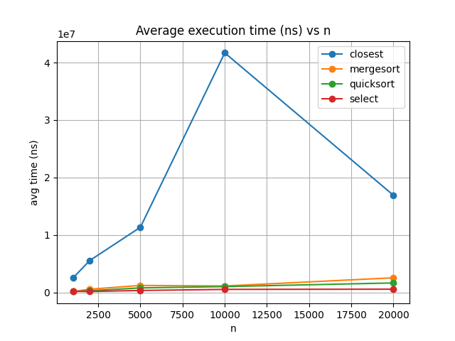

# Assignment 1 — Divide and Conquer Algorithms

## Learning Goals

* Implement classic *divide-and-conquer* algorithms with safe recursion patterns.
* Analyze running-time recurrences using **Master Theorem** (3 cases) and **Akra–Bazzi intuition**.
* Validate theoretical analysis with experimental measurements.
* Collect metrics (execution time, recursion depth, comparisons/operations).
* Communicate results via a short report and plots.
* Maintain a clean Git workflow (branches, commits, releases).

---

## Project Structure

```
pom.xml
requirements.txt
README.md
plots/                     # generated plots and summary tables
scripts/
 └── aggregate_and_plot.py # Python script to aggregate metrics and generate plots
src/
 ├── main/java/org/example/
 │   ├── metrics/          # Metrics collector (time, depth, comparisons)
 │   ├── sort/             # MergeSort and QuickSort implementations
 │   ├── select/           # Deterministic Select (Median of Medians)
 │   ├── closest/          # Closest Pair of Points (2D plane)
 │   ├── util/             # utility functions (swap, partition, shuffle, etc.)
 │   └── cli/              # Main.java entry point (runs benchmarks and writes CSV)
 └── test/java/org/example/test/
     ├── SortingTests.java
     ├── SelectTests.java
     └── ClosestPairTests.java
```

---

## Algorithms

### 1. MergeSort (D&C, Master Case 2)

* Divide the array into two halves, sort recursively, then merge.
* Uses a **single reusable buffer** across recursive calls.
* Switches to *Insertion Sort* for small arrays.
* Recurrence:

  ```
  T(n) = 2T(n/2) + Θ(n)  ⇒  T(n) = Θ(n log n)
  ```

### 2. QuickSort (robust)

* Pivot is chosen **randomly**.
* Always recurse into the **smaller partition**, handle the larger one iteratively → ensures stack depth O(log n).
* Recurrence (average case):

  ```
  T(n) = T(n/2) + T(n/2) + Θ(n) ⇒ Θ(n log n)
  ```

### 3. Deterministic Select (Median of Medians, O(n))

* Divide array into groups of 5, find median of each group.
* Recursively compute the **median of medians** as pivot.
* Recurse only into the side containing the k-th element.
* Guarantees O(n) worst-case runtime.

### 4. Closest Pair of Points (2D, O(n log n))

* Sort points by **x-coordinate**.
* Recursively solve for left and right halves.
* In the “strip”, check only 7–8 neighbors sorted by **y-coordinate**.
* Recurrence:

  ```
  T(n) = 2T(n/2) + Θ(n) ⇒ Θ(n log n)
  ```

---

##  Metrics and Plots

The program generates a CSV file (`metrics_ns.csv`) with recorded results.
Analysis can be done via Python (`aggregate_and_plot.py`) or Excel.

Collected metrics:

* **Execution time (ns)** — averaged across multiple trials.
* **Recursion depth** (for MergeSort and QuickSort).
* **Comparisons / swaps** (for sorting and Select).

### Example Table (average time, ns)

[execution_time_table.md](plots/execution_time_table.md)

### Example Plot


---

##  Testing

* **Sorting**: correctness on random and adversarial arrays.
* **Recursion depth**: verified that QuickSort depth ≤ 2⌊log₂n⌋ + O(1).
* **Select**: compared with `Arrays.sort(a)[k]` across 100 random trials.
* **Closest Pair**: validated against O(n²) implementation for n ≤ 2000.

---

##  Git Workflow

* Branches:

    * `main` — only stable releases (v0.1, v1.0).
    * `feature/*` — per-feature development branches.
* Commit storyline:

    * `init: maven, junit5, ci, readme`
    * `feat(mergesort): baseline + buffer reuse + cutoff + tests`
    * `feat(quicksort): randomized pivot + bounded recursion + tests`
    * `feat(select): deterministic select (MoM5) + tests`
    * `feat(closest): divide and conquer + tests`
    * `docs(report): master theorem cases & AB intuition + plots`
    * `release: v1.0`

---

## Summary

* Theory and experiments align:

    * MergeSort and QuickSort follow Θ(n log n).
    * Deterministic Select grows linearly, much slower than sorting.
    * Closest Pair behaves as Θ(n log n) but with a higher constant factor.
* Differences come from constant factors: cache locality, garbage collection, and Java overhead.
* Recursion is controlled everywhere → no risk of stack overflow.

---
